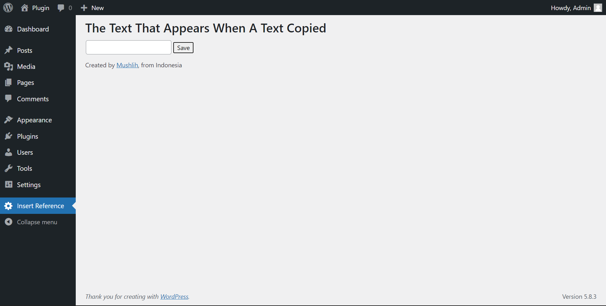
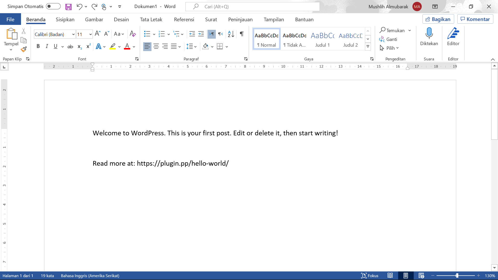

# Insert Link Reference In Copied Text
This WordPress plugin will add a reference from which site someone copied a text.

- Contributors: mushlih
- Tags: copy, insert, paste
- Requires at least: 4.7
- Tested up to: 6.0
- Requires PHP: 7.3.5
- Stable tag: 2
- License: GPLv2
- License URL: [LICENSE](LICENSE)

## Description
If someone copies an article on your site, then when that person pastes it, there will be additional text in the pasted text, and you can set with this plugin what text will appear if someone copies the article from your site.

This plugin is created and designed as simple as possible, so as not to burden your site, even the size of this plugin is not up to 1 MB!

## Installation
### - Download "Insert Link Reference In Copied Text Plugin" From WordPress Dashboard
1. Visit the plugins page in your WordPress dashboard and click "Add New".
2. Search for "Insert Link Reference In Copied Text".
3. Click "Install Now", then "Active".

### - Download "Insert Link Reference In Copied Text Plugin" Manually
1. Download the ZIP [latest version](https://github.com/mushlih-almubarak/Insert-Link-Reference-In-Copied-Text/releases/tag/v2) of this plugin.
2. Upload the plugin ZIP to the /wp-content/plugins/ directory, then extract it.
3. Activate the plugin through the ‘Plugins’ menu in the WordPress dashboard.

## Frequently Asked Questions
### How to use this plugin?
Go to the WordPress dashboard, then click the "Insert Reference" menu, add the words you want to add when someone copies text from your site, then click "Save".

## Screenshots

<b>Setting Page</b>
  

<b>Text that appears after copying</b>

## Changelog
### Version: 1
* Release Date: 11 February, 2022.
* First Release.

### Version: 2
* Release Date: 12 February, 2022.
* Fixing a bug.
